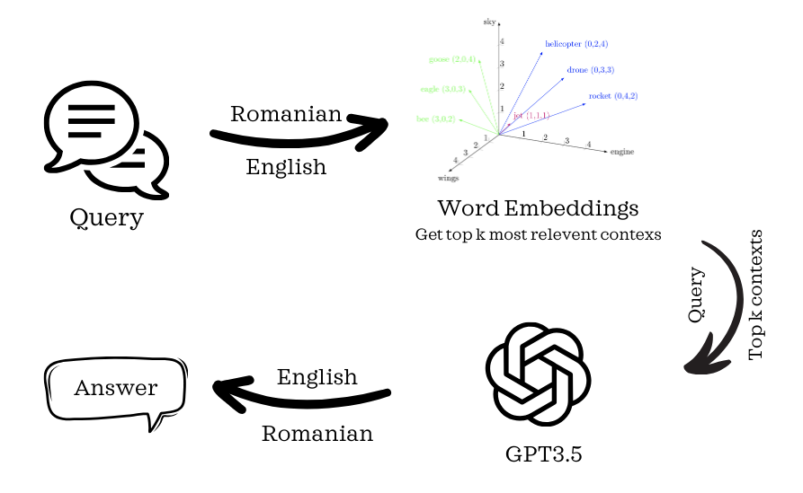

# RAG model trained on legal file in banking

## General Usage

`Modifed_RAG_with_sentence_transformer.ipynb` generates the word embedding file `text_chunks_and_embeddings_df.csv`. It is required a relatively strong computing power to run the `all-mpnet-base-v2` word embedding model from sentence_transformer, thus Google Colab can be a good idea. 

The `model.py` uses the word_embeddings previously generated to answer questiong. It can be run in CLI or it can be imported to another file. It uses the OpenAI API to translated the queries into Romanian, to retrieve the top k most relevent contexts from the `.csv` file, uses `gpt-3.5-turbo` model from OpenAI to generate a coherent answer using information from the retrieved conexts, later translating it back to Romanian. 

## Flow chart

